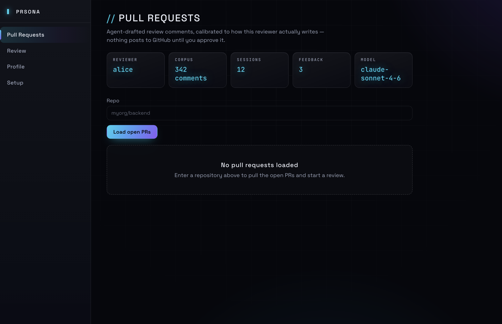
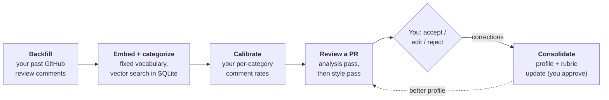
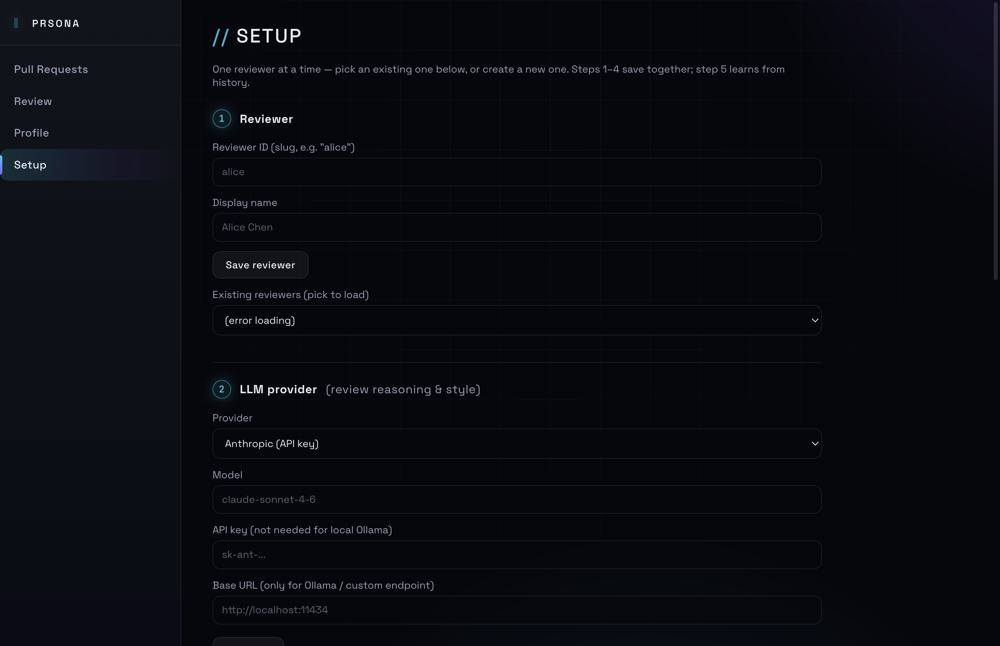
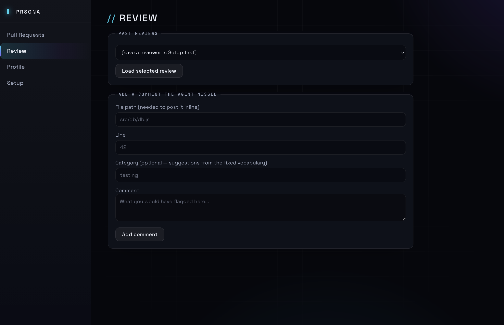

<div align="center">

# PRsona

### Your AI code reviewer that actually reviews like *you*

PRsona learns a specific person's review style from their own GitHub comment
history and drafts pull-request comments in that voice — running locally,
with your own API keys, posting nothing you haven't approved.

[Features](#features) · [How it works](#how-it-works) · [Quick start](#quick-start) · [Contributing](CONTRIBUTING.md)

[](https://github.com/drisyah/PRsona/actions/workflows/ci.yml)




</div>

---

## Why another AI reviewer?

CodeRabbit, Copilot, and friends review **like nobody in particular** —
generic comments from a generic model, tuned to nobody's standards, with
your code sent to someone else's cloud.

PRsona inverts the model: your review history *is* the training data.

| | Hosted review bots | **PRsona** |
|---|---|---|
| Style | Generic, one-size-fits-all | Learned from **your** past reviews |
| Data | Sent to the vendor | Stays on **your machine** |
| Model | Locked to their choice | Any: Claude, GPT, local Ollama, OpenAI-compatible |
| Posting | Auto-comments on PRs | Human approves **every** comment |
| Calibration | None | Filters by *your* per-category history |
| Cost | Per-seat SaaS | Free, MIT, bring your own keys |

## How it works



1. **Backfill** — pulls the reviewer's past PR comments from GitHub into a
   local SQLite database, categorizes them from a fixed vocabulary, and
   embeds them for retrieval.
2. **Review pipeline** (per PR) — two separate LLM calls on purpose, with
   plain-code calibration between them:
   - **Analysis pass** — style-agnostic: finds candidate issues in the
     diff, scored against the reviewer's learned rubric.
   - **Calibration** — plain code, not an LLM call: filters issues down to
     roughly match how often this reviewer actually comments on each
     category historically. Findings in categories you rarely comment on
     get dropped instead of nagging you; blocking issues and categories
     your history doesn't cover yet always survive. Full write-up:
     [docs/CALIBRATION.md](docs/CALIBRATION.md).
   - **Style pass** — rephrases the surviving issues in the reviewer's real
     voice, grounded in retrieved examples of their actual past comments
     (few-shot), not just an abstract description.
3. **Human review** — drafts are shown in-app; accept / edit / reject each
   one. Every resolution is logged as a "correction." A comment the agent
   missed can be added by hand and is logged too.
4. **Consolidation** (on demand, from the Profile tab) — a separate LLM
   call reads the accumulated corrections and proposes an updated profile
   (rubric + style). You see the diff and approve it before it's written —
   nothing updates silently.

Everything lives in one local SQLite file + one JSON profile file per
reviewer under the app's userData directory. No server, no external
database, no inbound network exposure — the app polls GitHub, GitHub never
calls it.

## Features

- **Learns from real history** — your corpus of past GitHub review
  comments becomes the rubric, the calibration baseline, and few-shot
  style examples.
- **Provider-agnostic** — Anthropic, OpenAI, Ollama (local), or any
  OpenAI-compatible endpoint (LM Studio, vLLM, llama.cpp server,
  OpenRouter…). Embeddings can use a *different* provider than the LLM.
- **Human-in-the-loop by construction** — drafts are editable, rejectable,
  and posted as a *pending* GitHub review; nothing notifies anyone until
  you submit from the GitHub UI.
- **Per-step self-tests** — Setup validates the LLM, embeddings, and
  GitHub token *at the field*. Verifying the token also auto-fills your
  backfill username.
- **Live dashboard** — the default screen shows reviewer, corpus size,
  sessions, pending feedback, and model at a glance.
- **Offline test suite** — 112 assertions across the pipeline and static
  wiring audit; no network, no API keys needed to test.
- **Honest about limits** — see [Design notes](#design-notes--known-simplifications).

## Screenshots

| Dashboard | Setup |
|---|---|
|  |  |

| Review |
|---|
|  |

## Requirements

- Node.js 22+ (for built-in `fetch`; `engines` requires `>=22.0.0` —
  `.nvmrc` pins 24)
- An LLM you can reach: an Anthropic/OpenAI API key, **or** a local runtime
  like [Ollama](https://ollama.com) with a model pulled
  (`ollama pull qwen2.5-coder:32b`, or similar).
- A GitHub personal access token — classic: `repo` scope (public-repo
  reads need no scope at all), or fine-grained: **Contents** +
  **Pull requests**, read and write. The write permission is only needed
  to post *pending* reviews.

## Quick start

```bash
git clone <this repo>
cd PRsona
npm install
npm start
```

Hit an install error (`node-gyp`, `rimraf`, `better-sqlite3`)? See
[Troubleshooting](docs/TROUBLESHOOTING.md).

On first launch, go to the **Setup** tab:

1. Create a reviewer (a slug like `alice`).
2. Choose an LLM provider and fill in its API key or local base URL.
   - Anthropic and OpenAI don't need a base URL.
   - Ollama defaults to `http://localhost:11434`.
   - "Custom OpenAI-compatible endpoint" covers LM Studio, vLLM,
     llama.cpp's server, OpenRouter, etc. — anything exposing a
     `/v1/chat/completions` route.
3. Optionally set a **separate** embeddings provider — useful if you want a
   frontier model for review reasoning but a free/local model for
   retrieval embeddings. Note: Anthropic doesn't expose an embeddings
   endpoint, so pick OpenAI, Ollama, or a compatible local model for this.
4. Add your GitHub token and the repos to watch.
5. **Save settings**, then use the per-step **Test LLM** / **Test embeddings**
   / **Test GitHub** buttons. Each tests the values currently on screen — not
   the saved config — so a mistake surfaces at the field, not later. Verifying
   the GitHub token also auto-fills your backfill username, since backfill
   matches your exact login (`you` ≠ `Your Name`).
6. Run **Backfill** with the reviewer's GitHub username to ingest, embed,
   and categorize their past review comments. (Categorization makes one LLM
   call per 25 uncategorized comments — only new ones, ever.)

Then use the **Pull Requests** tab to load open PRs and trigger a review —
it's the screen the app opens on, with a live status strip (reviewer, corpus
size, sessions, pending feedback, model) so you can tell at a glance whether
backfill has actually run. The **Review** tab accepts/edits/rejects drafts,
and the **Profile** tab inspects the learned rubric/style and runs
consolidation once you've accumulated some feedback.

### Testing & packaging

```bash
npm test                        # offline: pipeline suite + wiring audit
npm run dist -- --dir           # unpacked app in build/mac-arm64/
npm run dist                    # platform installers (dmg/zip on macOS)
```

The build is unsigned without a Developer ID, so macOS Gatekeeper will
warn on first launch — right-click the app → **Open** to bypass.

## Privacy & your data

- **Nothing leaves the machine except its intended destination.** API keys
  and your GitHub token live in one local config file
  (`~/Library/Application Support/pr-review-agent/config.json` on macOS);
  comments, embeddings, sessions, and corrections live in a local SQLite
  database in the same directory; profiles are plain JSON files under
  `profiles/`.
- **No telemetry, no analytics, no update pings.** The only outbound
  calls are to *your* chosen LLM provider and to the GitHub API.
- **You approve what GitHub sees.** Accepted drafts are assembled into a
  *pending* review — GitHub's unsubmitted state — and a human submits it
  from the GitHub UI as the final check.

## A note on "Claude subscription"

A claude.ai Pro/Max/Team subscription does not include programmatic API
access — this app talks to the Anthropic **Console** API, which is billed
separately per token. If cost matters more than model quality, a local
model via Ollama has no per-token cost at all, at the expense of needing
decent hardware and generally weaker instruction-following than frontier
models (the analysis/style prompts include a `strictness` knob that helps
compensate for this — see `src/pipeline/prompts.js`).

## Project layout

```
electron/           main process (window, IPC handlers) + preload bridge
src/db/              SQLite schema + query helpers (better-sqlite3)
src/llm/             provider abstraction: anthropic / openai / ollama / openai_compat
src/github/          GitHub REST client (backfill, PR diff, posting reviews)
src/pipeline/        analysis → calibrate → style → consolidate + prompts
src/profile/         reviewer profile JSON store + diffing for approval UI
src/config/          local settings store (electron-store)
renderer/            plain HTML/CSS/JS UI — no framework, no build step
test/                offline test suites (npm test)
docs/                screenshots + troubleshooting guide
```

## Design notes / known simplifications

- **Similarity search is brute-force cosine in JS**, not a vector DB. Fine
  for the corpus sizes this tool deals with (hundreds to low thousands of
  comments per reviewer) and keeps the whole app to a single SQLite file.
- **Categorization of backfilled comments is a separate pass** — after
  ingest + embed, `src/pipeline/categorize.js` labels each new comment from
  the fixed vocabulary in `src/pipeline/categories.js`. The analysis pass
  uses the same vocabulary, so calibration can join the two sides on
  category name. It only ever selects rows where `category IS NULL`, so
  re-running backfill never re-processes already-labeled comments, and a
  batch the model answers with unparseable JSON is left NULL for the next
  run instead of being stamped `uncategorized`. You can also hand-edit a
  reviewer's profile JSON directly (`<userData>/profiles/<reviewer>.json`)
  to seed it faster.
- **PR diffs aren't chunked** — very large PRs may exceed context limits,
  especially on local models with smaller windows. A straightforward
  follow-up is to split by file and run the analysis pass per file.
- **GitHub posting uses a pending review** — `createPendingReview` deliberately
  omits the `event` field, which is the only way to get a PENDING
  (unsubmitted) review: sending `event: "COMMENT"` would *submit* it
  immediately (and additionally requires a top-level `body`). Nothing is
  posted or notified until a human opens the PR and submits the review from
  the GitHub UI as a final check. Comments are authored by whichever account
  owns your token, not by the reviewer being modeled, and each one needs a
  file path plus a line present in the diff — GitHub 422s otherwise, so the
  submit button filters those out first.

## Contributing

PRs welcome — see [CONTRIBUTING.md](CONTRIBUTING.md) for the dev setup,
the three-layer IPC contract the wiring test enforces, and the PR
checklist. `npm test` must be green (it's fully offline).

## License

[MIT](LICENSE) © 2026 saril

---

<div align="center">

**If PRsona saves you review time, give it a ⭐ — it helps others find it.**

</div>
